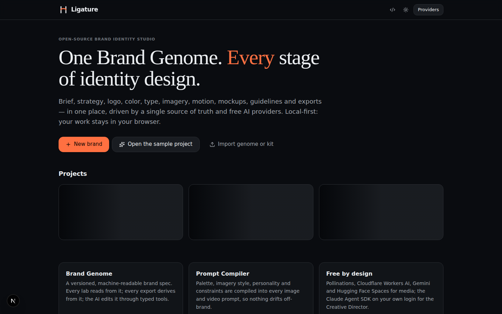
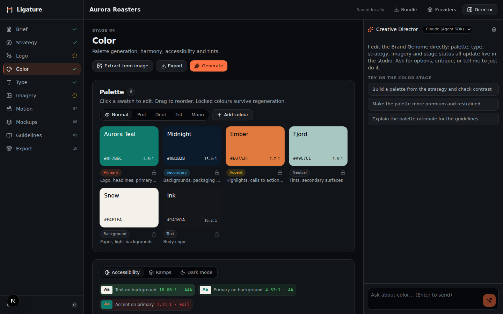
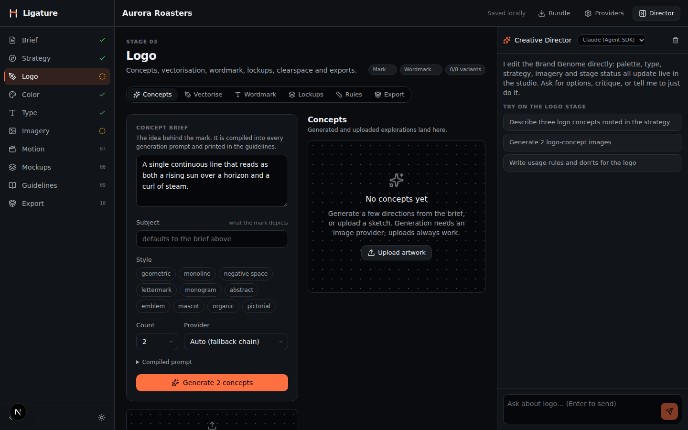
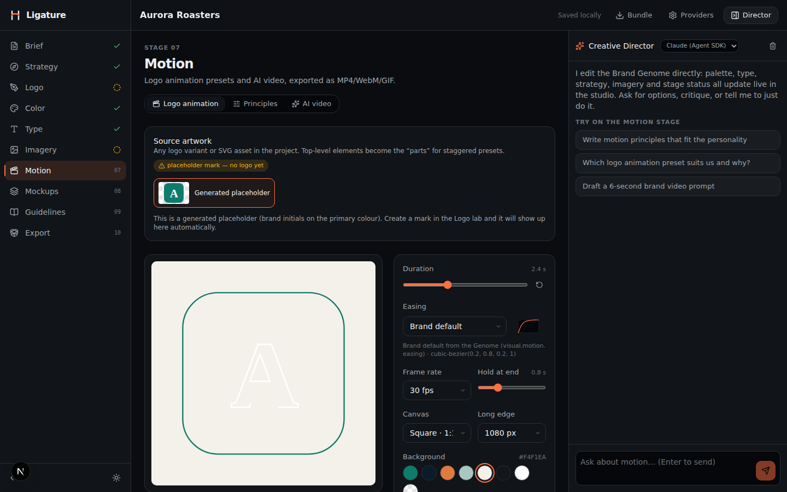
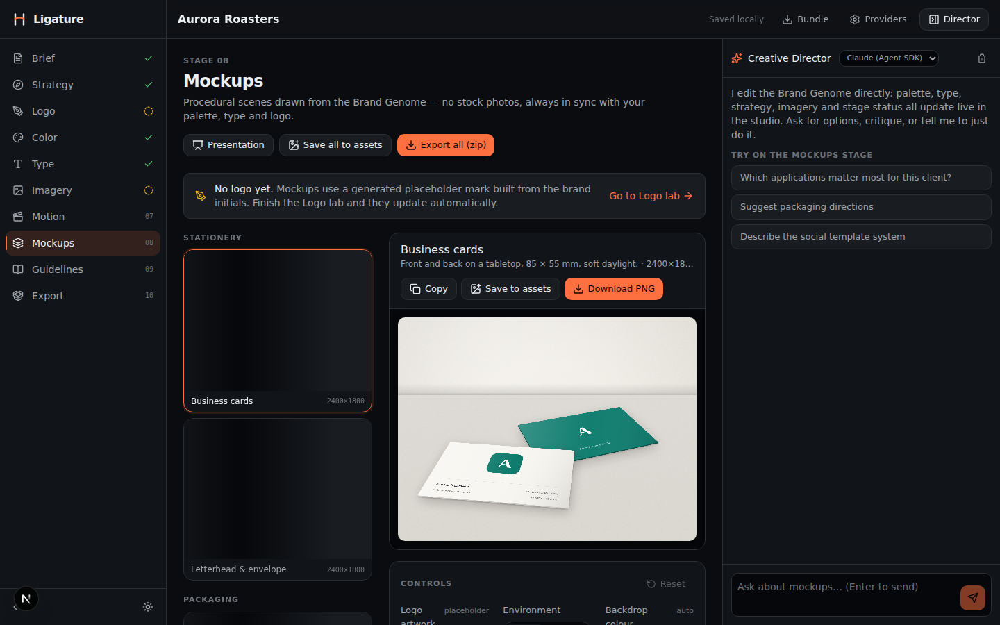
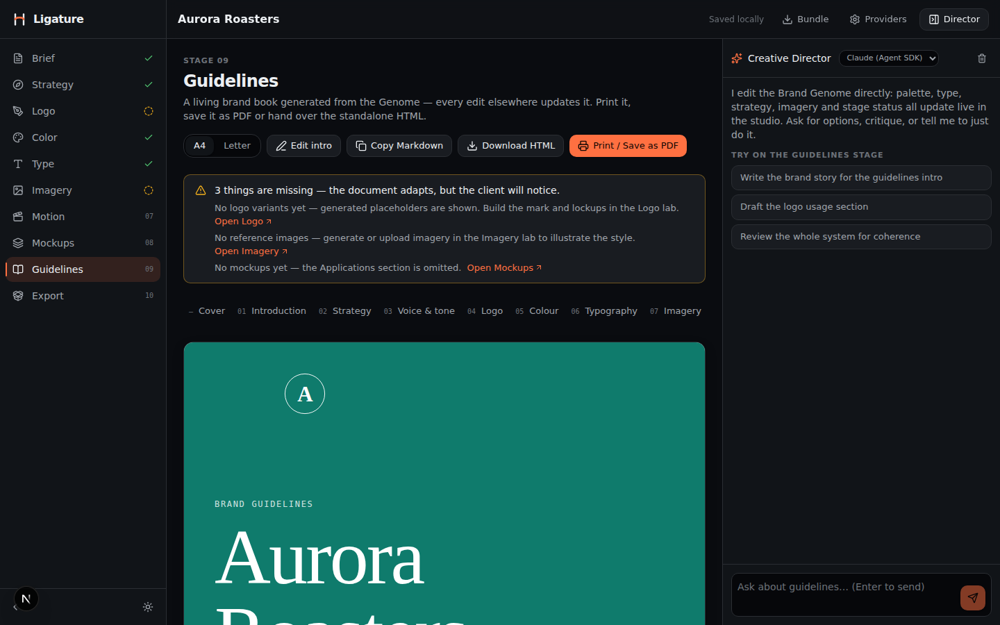

<p align="center">
  
</p>

<h1 align="center">Ligature</h1>

<p align="center"><strong>The open-source brand identity studio.</strong><br/>
One Brand Genome. Every stage of identity design — brief, strategy, logo, color, type, imagery, motion, mockups, guidelines, export — in a single local-first web app, driven by free AI providers.</p>

<p align="center">
  <a href="LICENSE"></a>
  
  
  
</p>

---

## A look inside

| | |
|---|---|
|  |  |
|  |  |
|  |  |

## Why

Designing a brand identity today means juggling ten tools: a doc for the brief, a slide deck for strategy, an image model for exploration, a vectoriser, a palette site, a font-pairing site, a contrast checker, a mockup marketplace, a video tool, and a guidelines builder — none of which know about each other. The brand drifts between them.

Ligature replaces the juggling with one document and one workspace:

- **The Brand Genome** is a versioned, machine-readable brand spec (strategy + verbal + visual system). Every lab reads from it, every export derives from it, and the AI edits it through typed tools. Nothing is ever out of sync.
- **The Prompt Compiler** turns the Genome plus an intent ("hero image", "logo concept", "seamless pattern") into provider-specific prompts, so every generated image or video is conditioned on your palette, imagery style, personality and constraints.
- **The Creative Director** is an AI collaborator with real tools: read and edit the Genome, set the palette, pair typefaces, generate on-brand imagery, check contrast, advance stages. It runs on the Claude Agent SDK using your own Claude Code login, or on free hosted models.

Everything stays in your browser (IndexedDB). No accounts, no server database, no telemetry.

## What's inside

| Stage | Lab | Highlights |
|---|---|---|
| 01 | **Brief** | Structured brief + guided discovery questionnaire, completeness health |
| 02 | **Strategy** | Positioning builder, 12 archetypes, personality axes with radar, tagline options, tone of voice |
| 03 | **Logo** | AI concept sheets → background removal → vectorisation (in-browser) → wordmark with real font outlines → lockups, mono/reversed variants, clearspace & minimum size, do/don't board, logo kit ZIP with favicons |
| 04 | **Color** | OKLCH harmonies, personality-aware palette generation, extract from image, WCAG + APCA matrix, tint/shade ramps, colour-blindness simulation, dark-mode overrides, CSS/SCSS/Tailwind/DTCG/ASE export |
| 05 | **Type** | Google Fonts browser (no key), curated & scored pairings, modular scale, text styles, live specimens, CSS export |
| 06 | **Imagery** | Imagery style definition, brand-conditioned generation with provider fallback, editing, background removal, references, moodboards |
| 07 | **Motion** | Logo animation presets rendered in the browser to MP4/WebM/GIF, motion principles, AI text-to-video and image-to-video |
| 08 | **Mockups** | Procedural, auto-recoloured mockups (cards, signage, packaging, apparel, digital, social) with real perspective; presentation board |
| 09 | **Guidelines** | Auto-generated, always-in-sync brand guidelines; print to PDF, standalone HTML, Markdown |
| 10 | **Export** | Brand kit ZIP: logos, favicons, tokens (DTCG, Tokens Studio, CSS, SCSS, Tailwind, ASE, GPL), typography CSS, social kit, guidelines, project bundle |

## Free AI providers

Ligature never asks you to pay for a service. You choose which providers to enable; it falls back down the list automatically.

| Provider | Used for | Cost | Key? |
|---|---|---|---|
| **Claude Agent SDK** | Creative Director (best quality; full tool loop) | Included in your Claude Pro/Max plan, or pay-as-you-go with an API key | Your local `claude` login, or `ANTHROPIC_API_KEY` |
| **Pollinations** | Images (FLUX), image editing, text models, text/image-to-video | Free; a free key adds weekly Pollen for premium models | Optional — [enter.pollinations.ai](https://enter.pollinations.ai) |
| **Cloudflare Workers AI** | Images (FLUX.1 schnell ≈ 170/day), text models | Free 10,000 neurons/day | Free account — [dash.cloudflare.com](https://dash.cloudflare.com) |
| **Google Gemini** | Text models; image generation & editing (free-tier availability varies by model) | Free tier | Free key — [aistudio.google.com](https://aistudio.google.com/apikey) |
| **Hugging Face Spaces** | Images and video (LTX-2, Wan…) on free GPU queues | Free (queue-based) | Optional token raises quota |
| **Any OpenAI-compatible** | Creative Director on Ollama, LM Studio, Groq, OpenRouter… | Free / your choice | Depends |

> **About the Claude Agent SDK and your subscription.** Ligature runs the Agent SDK on *your* machine and never handles your credentials: it uses whatever the local Claude Code CLI is signed in with. Anthropic's help center confirmed on 15 June 2026 that Agent SDK usage, `claude -p`, and third-party apps built on the Agent SDK continue to draw from Pro/Max subscription limits. Ligature does not offer, proxy or resell claude.ai login; if you deploy Ligature for other people, they bring their own auth (or set an API key). Free tiers and terms change — check each provider's current page.

## Try it

| Route | What you get |
|---|---|
| [**Open in GitHub Codespaces**](https://github.com/codespaces/new?repo=Naweed-Hesan/Graphic-Designer-Agent&ref=claude/sleepy-sagan-p1eah2) | The full studio running in a cloud VM in about two minutes, nothing to install (free monthly hours on personal accounts). Ligature opens on the forwarded port 3000. |
| [**Deploy to Vercel**](https://vercel.com/new/clone?repository-url=https://github.com/Naweed-Hesan/Graphic-Designer-Agent&project-name=ligature&repository-name=ligature) | A public URL on the free tier. Everything works except the Claude Agent SDK bridge (it needs a persistent Node process with Claude Code); use Pollinations, Gemini or Cloudflare there. Deploys the default branch, so merge first. |
| **Run locally** | Best experience, and the only place the Creative Director can use your Claude Max login. See Quick start below. |

## Quick start

Requirements: Node 20+ (22 recommended) and [pnpm](https://pnpm.io).

```bash
git clone -b claude/sleepy-sagan-p1eah2 https://github.com/Naweed-Hesan/Graphic-Designer-Agent.git ligature
cd ligature
pnpm install
pnpm dev
```

Open http://localhost:3000, click **Open the sample project** to see every lab populated, or **New brand** to start from a blank Genome.

**Enable the Creative Director on Claude:** install Claude Code and sign in once (`npm i -g @anthropic-ai/claude-code && claude`), or export `ANTHROPIC_API_KEY`. Then in **Providers → Assistant** pick *Claude* and click *Test connection*. No Claude? Pick *Pollinations* — it works with no key at all.

**Add free provider keys:** **Providers → Keys** (stored only in your browser), or copy `.env.example` to `.env.local`.

## How it fits together

```
src/
  lib/genome/        Brand Genome schema (zod), defaults, archetypes, stages, path ops
  lib/store/         zustand stores (project + settings), autosave to IndexedDB (Dexie)
  lib/providers/     image + video providers with fallback chains (server side)
  lib/ai/            Creative Director: Claude Agent SDK bridge, OpenAI-compatible loop, tools, system prompt
  lib/imagery/       Prompt Compiler
  lib/color|type|logo|motion|mockups|guidelines|export
                     Pure, testable domain logic for each lab
  app/api/           Route handlers: generate/image, generate/video, ai/chat (NDJSON stream), fonts, providers/models
  components/labs/   One folder per stage, code-split
  components/shell/  Dashboard, studio shell, settings
  components/assistant/  Streaming chat with tool cards and live Genome patches
```

**The Genome** (`src/lib/genome/schema.ts`) has `brief`, `strategy`, `visual.{palette,typography,logo,imagery,elements,motion}`, `stages` and a `history`. Assets (images, SVGs, videos) are stored alongside it in IndexedDB and referenced by id. A project can be exported as a `.ligature.zip` bundle (Genome + assets) and re-imported anywhere.

**The Creative Director** streams NDJSON events: `text`, `tool-start`, `tool-end`, `genome-ops` (applied live to the store), `asset` (saved to the project), `done`. The same tool definitions (`src/lib/ai/tools.ts`) serve both the Claude Agent SDK (as an in-process MCP server) and OpenAI-style function calling, so any provider gets the same capabilities.

## Keyboard shortcuts

| Keys | Action |
|---|---|
| `⌘/Ctrl + J` | Toggle the Creative Director |
| `⌘/Ctrl + ,` | Providers & settings |
| `Alt + ← / →` | Previous / next stage |

## Deploying

Ligature is a plain Next.js app. Run it on your machine (recommended — this is where the Claude Agent SDK can use your login), a home server, or any Node host. On serverless hosts (Vercel, Netlify) everything works except the Claude bridge, which needs a persistent Node process with Claude Code available; use Pollinations/Gemini/Cloudflare or an API key there. Long-running generations (Hugging Face queues, video) may exceed serverless timeouts.

## Scripts

```bash
pnpm dev      # dev server
pnpm build    # production build
pnpm start    # serve the build
pnpm lint     # eslint (React Compiler rules on)
pnpm tsc --noEmit
pnpm test     # vitest — pure domain logic
```

## Roadmap

- MCP server so Claude Code (or any MCP client) can drive a running studio directly
- SVG node editor for logo refinement (path editing, boolean ops)
- Photographic mockup packs with smart-object style displacement
- Motion templates for social (lower thirds, story reveals) and Lottie export
- Shareable read-only guidelines links and client feedback threads
- Right-to-left typography and Arabic-first type pairing
- Provider plugins (bring your own image/video/LLM endpoint)

## Contributing

Issues and pull requests are welcome. Read [CONTRIBUTING.md](CONTRIBUTING.md) and the contributor guide in [CLAUDE.md](CLAUDE.md) (it doubles as the architecture map). Each lab keeps its logic in `src/lib/<area>` (pure, unit-testable) and its UI in `src/components/labs/<stage>`.

## Acknowledgements

Built on the shoulders of open projects: [Pollinations](https://github.com/pollinations/pollinations), [culori](https://culorijs.org), [imagetracerjs](https://github.com/jankovicsandras/imagetracerjs), [@imgly/background-removal](https://github.com/imgly/background-removal-js), [mediabunny](https://github.com/Vanilagy/mediabunny), [gifenc](https://github.com/mattdesl/gifenc), [opentype.js](https://opentype.js.org), [Google Fonts](https://fonts.google.com) & [Fontsource](https://fontsource.org), [APCA](https://github.com/Myndex/apca-w3), [Dexie](https://dexie.org), [Next.js](https://nextjs.org).

## License

[MIT](LICENSE) © Naweed Hesan and Ligature contributors.
